# 🚗 Apex Motors — Car Dealership Inventory System

A full-stack vehicle catalog and inventory management application. Customers can register, browse and search vehicles, and purchase available stock. Administrators have a dedicated dashboard for managing the catalog and restocking inventory.

**Live Demo:** Not deployed
**Repository:** <https://github.com/Gnaneshwari017/car-dealership-inventory-system>

## ✨ Key Features & Architecture

- JWT-based registration, login, and protected API requests.
- Vehicle catalog with make, model, category, price, and stock search filters.
- Purchase processing that prevents inventory from dropping below zero and records purchases.
- Dedicated admin dashboard for vehicle creation, editing, deletion, and restocking.
- FastAPI routers, services, repositories, SQLAlchemy models, and Alembic migrations.
- React/Vite client styled with Tailwind CSS and connected through Axios.

## 👤 Customer Features

- Register and log in.
- View the vehicle catalog and individual vehicle details.
- Search by make, model, category, and price range.
- Purchase an in-stock vehicle and see updated availability.
- Receive an out-of-stock response when no units remain.

## 🛠️ Administrator Features

- Access the Admin Inventory Console in the frontend.
- Add, update, and delete vehicle records.
- Restock a vehicle with a positive quantity.
- Review inventory totals and sold-out items.

## 🔄 Application Flow

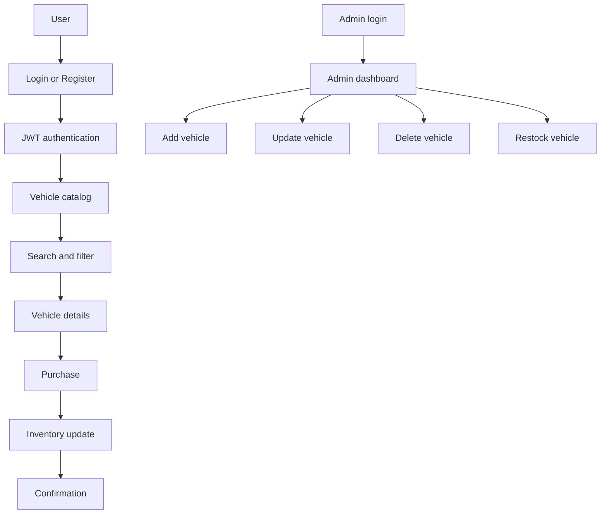

## 🏗️ System Architecture

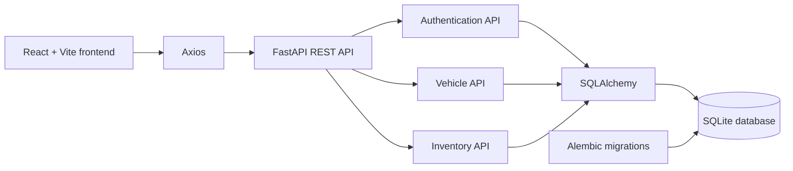

## 🧰 Technology Stack

| Area | Technologies used |
| --- | --- |
| Backend | Python, FastAPI, Uvicorn |
| Data | SQLite, SQLAlchemy, Alembic |
| Authentication | JWT with `python-jose`; password hashing with Passlib/Bcrypt |
| Frontend | React, TypeScript, Vite, Tailwind CSS |
| API client | Axios |
| Testing | Pytest; Vitest and React Testing Library |

## 🚀 Getting Started & Local Setup

### Prerequisites

- Python 3.13 or later
- Node.js and npm
- Git

Clone the repository, then use two terminals—one for the backend and one for the frontend.

```bash
git clone https://github.com/Gnaneshwari017/car-dealership-inventory-system.git
cd car-dealership-inventory-system
```

### Backend Setup

```powershell
cd backend
python -m venv .venv
.venv\Scripts\Activate.ps1
pip install -r requirements.txt
```

### Environment Variables

The backend reads `backend/.env` when present. `.env` files are ignored by Git; use safe local values and never commit a real JWT secret. The checked-in [backend environment example](backend/.env.example) documents these settings:

```env
DATABASE_URL=sqlite:///./dealership.db
JWT_SECRET=generate-a-secure-random-256-bit-key-in-production
JWT_ALGORITHM=HS256
ACCESS_TOKEN_EXPIRE_MINUTES=1440
CORS_ORIGINS=http://localhost:5173,http://localhost:3000,http://127.0.0.1:5173
ENVIRONMENT=development
PROJECT_NAME="Apex Motors Car Dealership Inventory API"
```

`API_V1_STR` is also configurable in the application and defaults to `/api`.

### Database Setup

Apply the checked-in Alembic migration from the `backend` directory:

```bash
alembic upgrade head
```

### Seed Demo Data

Populate the SQLite database with the project’s seed command:

```bash
python -m app.utils.seed
```

The seed module creates example accounts and vehicles if they are missing. Refer to the seed source when you need its current local credentials; they are intentionally not reproduced here.

### Start Backend

```bash
python -m uvicorn app.main:app --reload --port 8000
```

- Swagger UI: <http://127.0.0.1:8000/docs>
- Health check: <http://127.0.0.1:8000/health>

### Frontend Setup

In a second terminal:

```bash
cd frontend
npm install
```

The frontend supports `VITE_API_URL` and defaults to `/api`, as shown in [frontend/.env.example](frontend/.env.example). The current Vite proxy targets port `5000`; when using the backend command above on port `8000`, create a local `frontend/.env.local` with this value before starting Vite:

```env
VITE_API_URL=http://127.0.0.1:8000/api
```

### Start Frontend

```bash
npm run dev
```

Vite is configured to serve the application on <http://localhost:5173>.

## 🔐 Authentication Flow

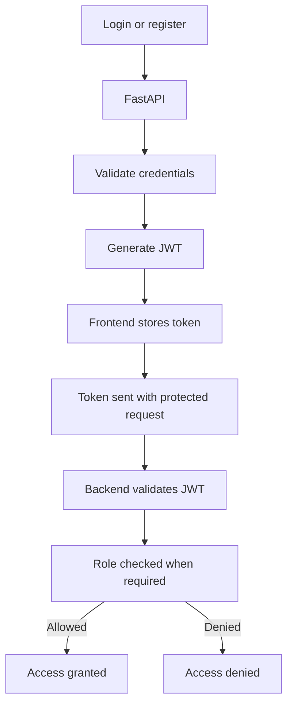

The Axios client attaches the stored bearer token to requests. The backend validates the token and resolves the current user before serving protected endpoints.

## 🧭 Role-Based Access Control

All catalog and purchase endpoints require an authenticated user. The API restricts vehicle deletion and restocking to the `ADMIN` role; the frontend also gates the Admin Inventory Console for admins. Registration accepts a role field, with `USER` as the default.

## 🚘 Vehicle Inventory Flow

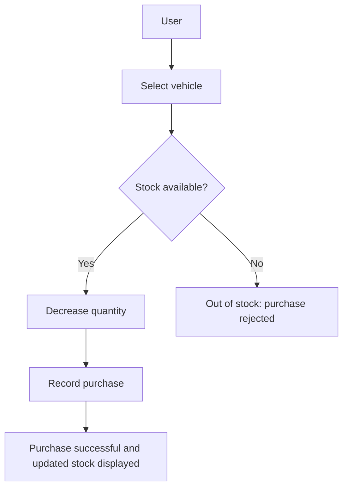

Purchases use a guarded database update so inventory is not reduced below zero.

## 📦 Inventory Management Flow

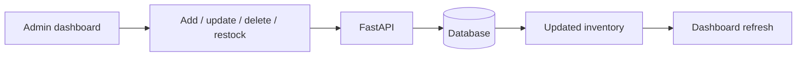

## 🧪 Test-Driven Development (TDD)

The repository contains backend unit and integration tests plus frontend component and page tests. They cover authentication, inventory behavior, vehicles, and UI interactions.

### Running Backend Tests

```bash
cd backend
python -m pytest -q
```

### Running Frontend Tests

```bash
cd frontend
npm test
```

### Actual Test Results

Latest local verification for this documentation update:

| Suite | Result |
| --- | --- |
| Backend (`python -m pytest -q`) | 44 passed |
| Frontend (`npm test`) | 7 test files passed; 27 tests passed |
## Overall Result

| Test Suite |  Tests | Result          |
| ---------- | -----: | --------------- |
| Backend    |     44 | ✅ Passed        |
| Frontend   |     27 | ✅ Passed        |
| **Total**  | **71** | **✅ 71 Passed** |

## 📚 API Endpoints Reference

All API routes below are prefixed with `/api`.

### Authentication

| Method and endpoint | Description | Access |
| --- | --- | --- |
| `POST /auth/register` | Register an account and receive a token. | Public |
| `POST /auth/login` | Authenticate and receive a token. | Public |
| `GET /auth/me` | Get the current user profile. | Authenticated |

### Vehicles

| Method and endpoint | Description | Access |
| --- | --- | --- |
| `GET /vehicles` | List vehicles. | Authenticated |
| `GET /vehicles/{id}` | Get one vehicle. | Authenticated |
| `POST /vehicles` | Create a vehicle. | Authenticated |
| `PUT /vehicles/{id}` | Update a vehicle. | Authenticated |
| `DELETE /vehicles/{id}` | Delete a vehicle. | Admin |

### Search & Filtering

| Method and endpoint | Description | Access |
| --- | --- | --- |
| `GET /vehicles/search` | Filter by `make`, `model`, `category`, `min_price`, or `max_price`. | Authenticated |

### Inventory Operations

| Method and endpoint | Description | Access |
| --- | --- | --- |
| `POST /vehicles/{id}/purchase` | Purchase one in-stock unit. | Authenticated |
| `POST /vehicles/{id}/restock` | Add a positive stock quantity. | Admin |

Interactive API documentation is available through Swagger at `/docs` while the backend is running.

## 🛡️ Security

- Passwords are hashed before storage.
- JWTs protect authenticated API routes.
- Admin-only dependencies guard deletion and restocking operations.
- SQLAlchemy is used for database access.
- Configuration is read from environment variables; `.env` is ignored by Git.

## 📁 Project Structure

```text
car-dealership-inventory-system/
├── backend/
│   ├── alembic/                 # Migration environment and versions
│   ├── app/
│   │   ├── core/                # Settings, database, and security
│   │   ├── dependencies/        # Authentication dependencies
│   │   ├── models/              # SQLAlchemy models
│   │   ├── repositories/        # Data access layer
│   │   ├── routers/             # Auth, vehicle, and inventory APIs
│   │   ├── schemas/             # Request/response schemas
│   │   ├── services/            # Application logic
│   │   └── utils/seed.py        # Demo data seeding
│   ├── tests/                   # Pytest unit and integration tests
│   ├── requirements.txt
│   └── alembic.ini
├── frontend/
│   ├── public/images/cars/      # Vehicle images
│   ├── src/                     # React source code
│   ├── tests/                   # Vitest component/page tests
│   ├── package.json
│   └── vite.config.ts
├── screenshots/
├── PROMPTS.md
└── README.md
```


## 🖼️ Screenshots

### Homepage

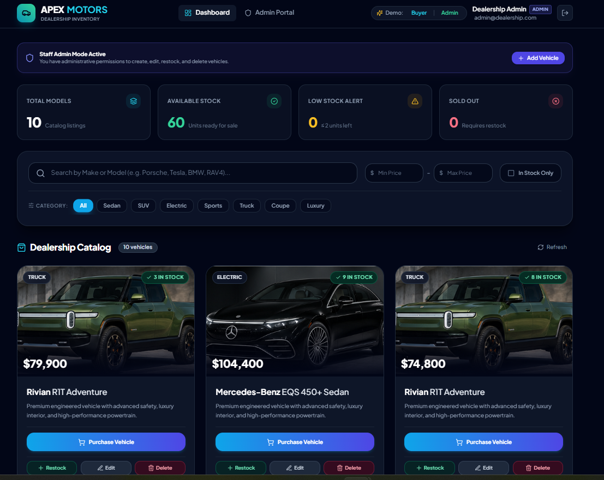

### Register

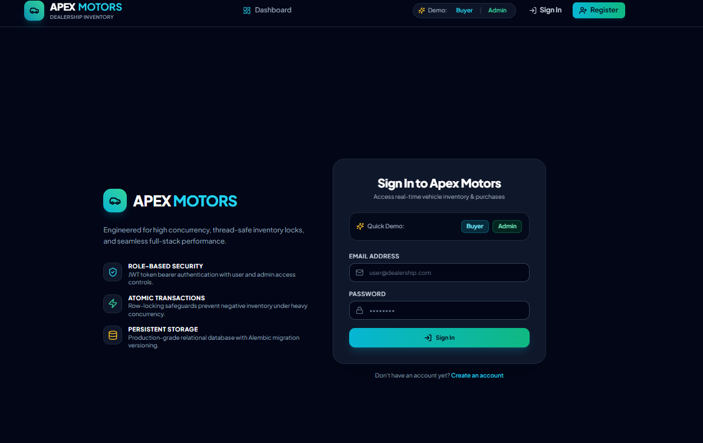

### Vehicle Catalog

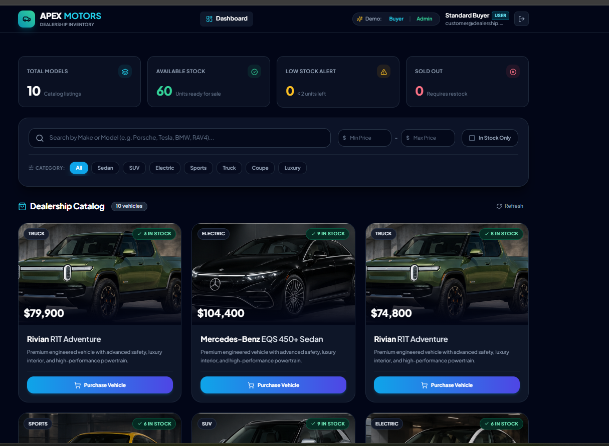

### Complete Dashboard

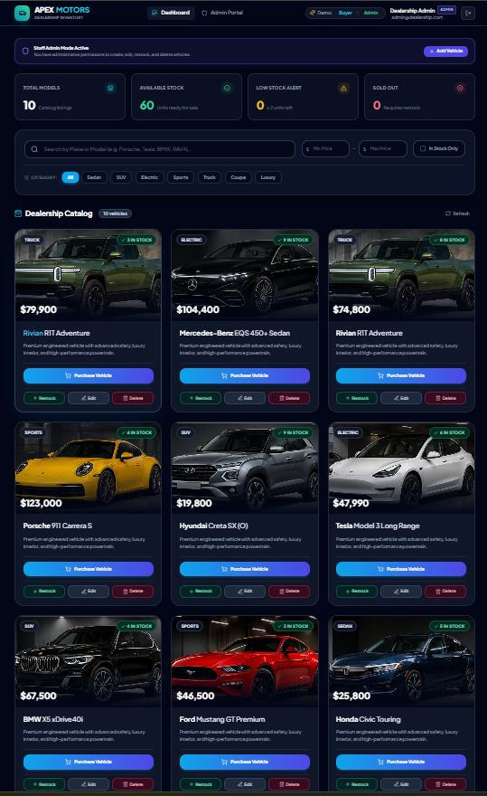

### Admin Dashboard

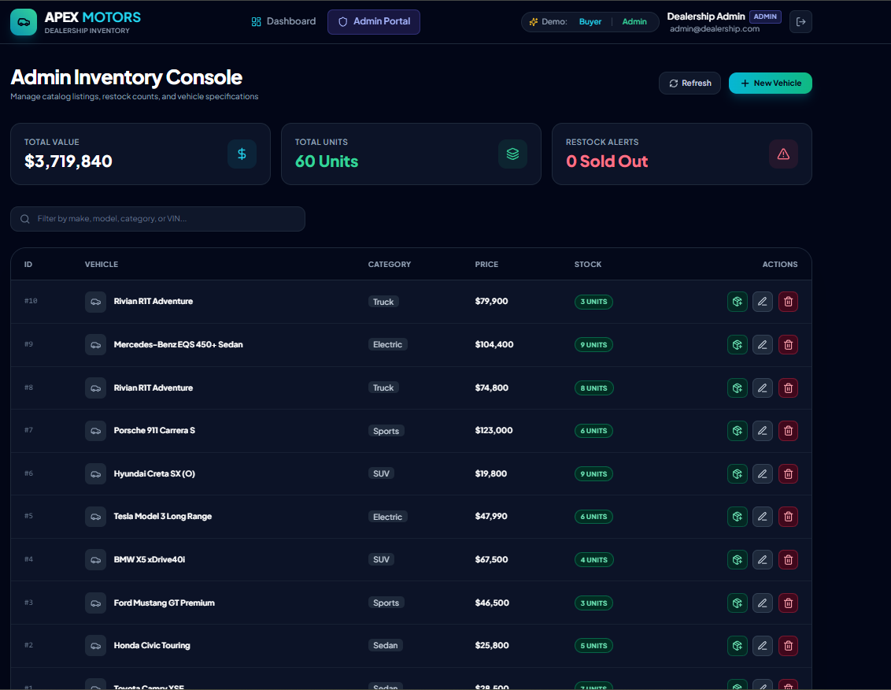

### Add New Vehicle

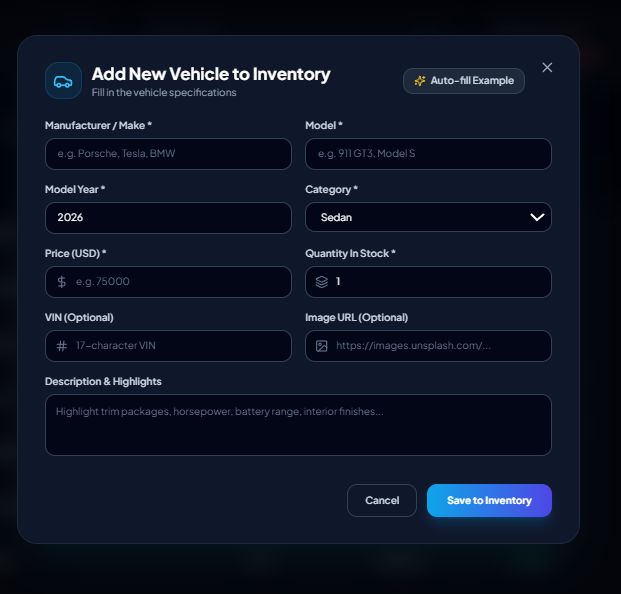

### Edit Vehicle

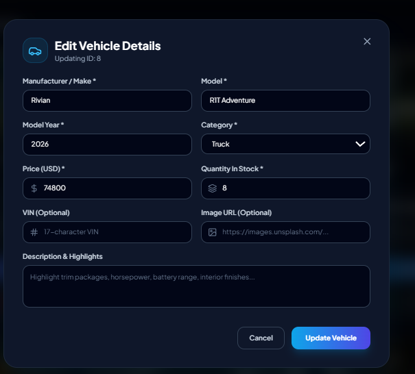

### Delete Vehicle

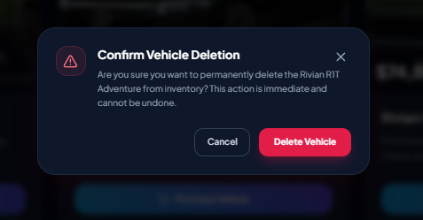

### Purchase Vehicle

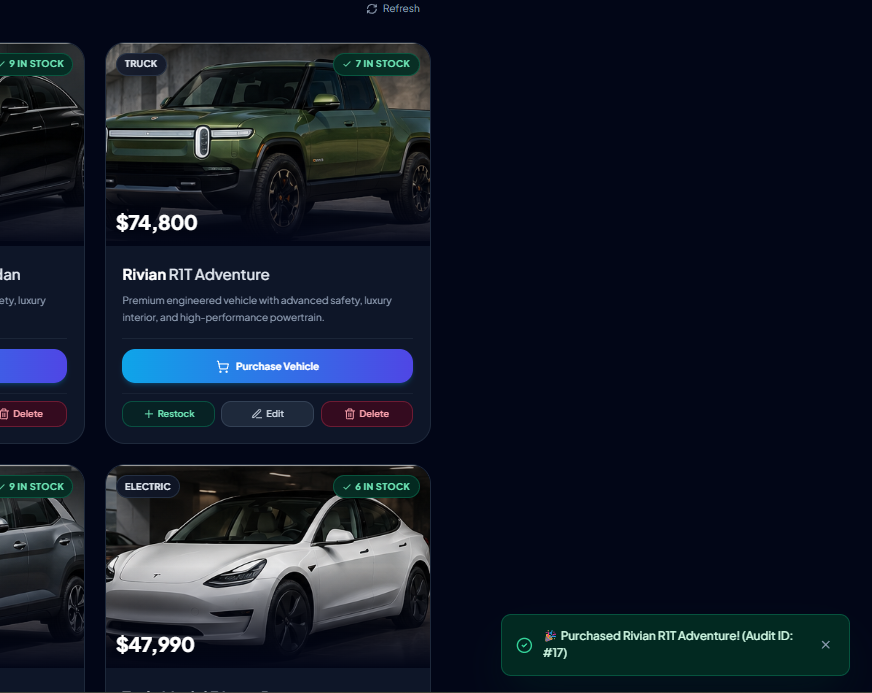

 ## 🤖 My AI Usage

### AI Tools Used

I used AI development tools during this project, primarily Gemini and ChatGPT.

### How I Used AI

AI tools were used to assist with:

- Project architecture and folder structure planning.
- FastAPI backend implementation and API design.
- JWT authentication and authorization.
- SQLAlchemy models and database configuration.
- Writing and improving backend unit and integration tests.
- React and TypeScript component development.
- Tailwind CSS UI implementation.
- Debugging frontend and backend errors.
- API integration and Axios configuration.
- Git and GitHub workflow guidance.
- README and project documentation preparation.
- Reviewing test failures and troubleshooting implementation issues.

### My Responsibility

AI was used as a development assistant rather than as a replacement for understanding the implementation. I reviewed the generated code, integrated the changes into the project, ran the application locally, executed the automated test suites, debugged failures, and verified the final functionality.

### Reflection

Using AI significantly accelerated development and debugging, particularly when working through API integration, testing, frontend issues, and Git workflows. It also helped me explore alternative implementations quickly. However, I remained responsible for validating the generated code, understanding the implementation, testing the application, and making the final engineering decisions.
## 🔗 GitHub Repository

<https://github.com/Gnaneshwari017/car-dealership-inventory-system>

## 📄 License

No license file is currently included in this repository.
